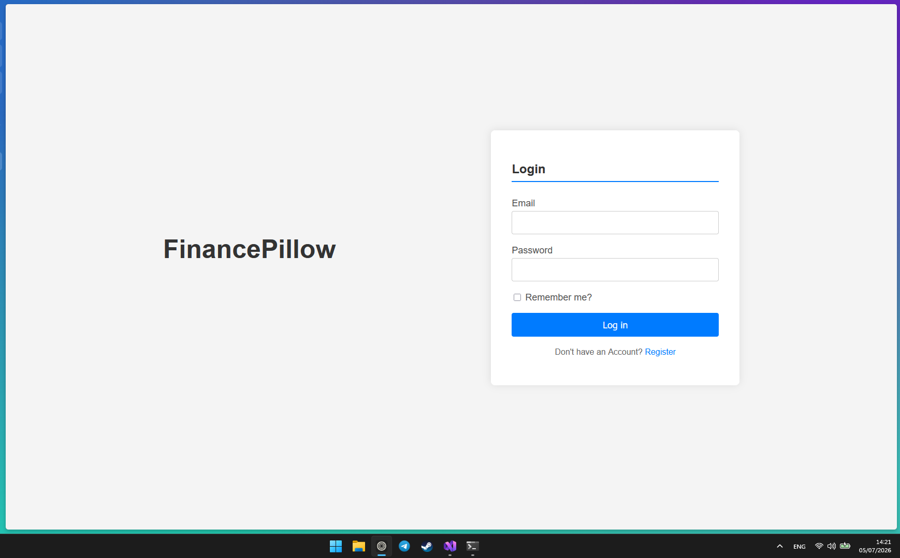
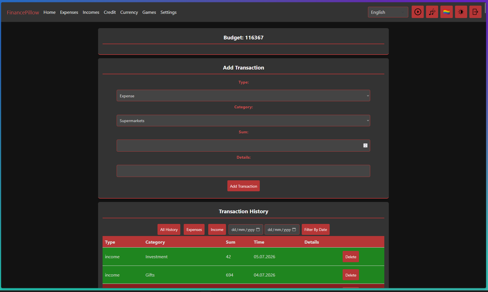
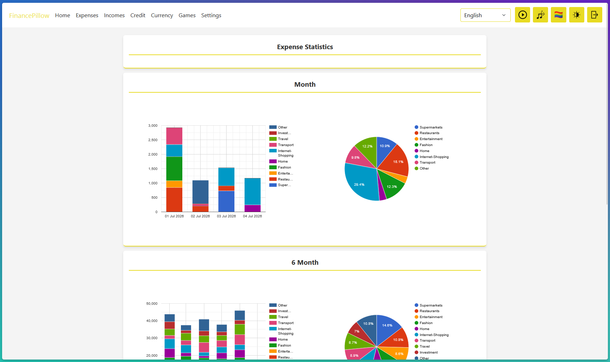
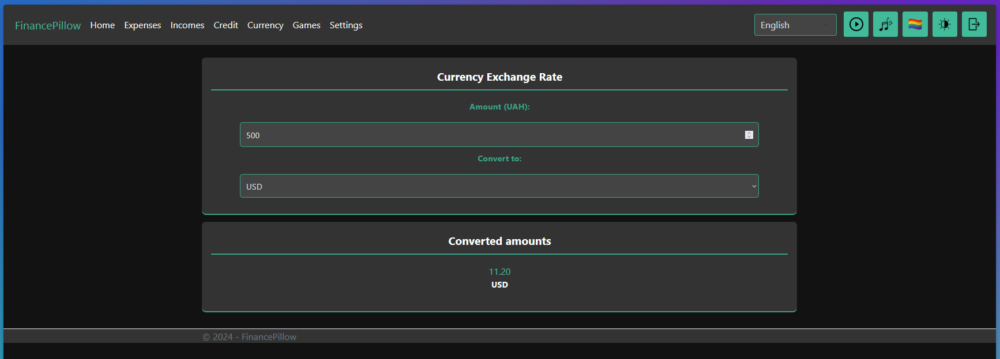

# FinancePillow

FinancePillow is a personal finance tracking application built with a robust **.NET/C#** backend. It allows users to securely log income, track expenses, visualize spending statistics, and calculate currency exchanges. 

The project leverages **Entity Framework Core** using a Code-First workflow for seamless object-relational mapping, backed by a relational **PostgreSQL** database and secured via **ASP.NET Core Identity**.

---
## Key Features

* **Secure Authentication:** Integrated with ASP.NET Core Identity to handle user registration, encrypted login sessions, and secure data isolation per account.
* **Unified Financial Dashboard:** A clean user interface to log incomes and expenses simultaneously, equipped with an instant-updating transaction history log.
* **Data-Driven Statistics:** Generates visual updates on spending categories to give users precise control over their financial habits.
* **Currency Exchange Toolkit:** Features dedicated tracking tools to convert and evaluate assets across multiple currencies.

---
## App Interface Tour

| Login & Authentication | Homepage & Transactions |
| :---: | :---: |
|  |  |
| *Secure user authentication layer.* | *Live balance tracking, transaction history, and entry forms.* |

| Data Insights & Statistics | Currency Exchange |
| :---: | :---: |
|  |  |
| *Categorical breakdown of expense statistics* | *Currency Exchange Rates* |

---

## 🛠️ Tech Stack & Architecture

* **Backend Framework:** .NET 8.0 / C#
* **Object-Relational Mapper (ORM):** Entity Framework Core
* **Database Engine:** PostgreSQL
* **Security & Auth:** ASP.NET Core Identity
* **Architecture Pattern:** Repository Pattern (separating business layers from raw data access contexts)